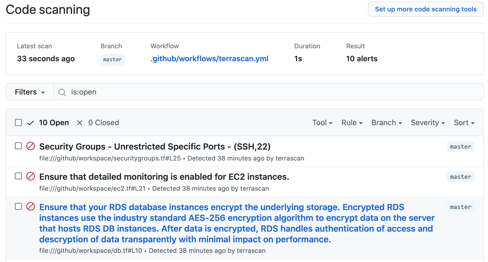

# Terrascan GitHub Action
[](https://sonarcloud.io/summary/new_code?id=tenable_terrascan-action)

This action runs Terrascan, the infrastructure as code (IaC) scanner for security best practices. It supports displaying the results of the scan in the GitHub repository's Security tab under [code scanning alerts](https://docs.github.com/en/code-security/secure-coding/automatically-scanning-your-code-for-vulnerabilities-and-errors/about-code-scanning), when the `sarif_upload` input variable is included.

## Where to get help

* To learn more about Terrascan's features and capabilities, see the documentation portal: https://runterrascan.io
* Join our community on [Discord](https://discord.gg/ScUPMzyG3n)

## Inputs for the GitHub Action
### `iac_type`
**Required** IaC type (helm, k8s, kustomize, terraform).

### `iac_dir`
Path to a directory containing one or more IaC files. Default `"."`.

### `iac_version`
IaC version (helm: v3, k8s: v1, kustomize: v3, terraform: v12, v14).

### `non_recursive`
Do not scan directories and modules recursively

### `policy_path`
Policy path directory for custom policies.

### `policy_type`
Policy type (all, aws, azure, gcp, github, k8s). Default `all`.

### `skip_rules`
One or more rules to skip while scanning (example: "ruleID1,ruleID2").

### `config_path`
Config file path.

### `only_warn`
The action will only warn and not error when violations are found.

### `sarif_upload`
If this variable is included, a sarif file named terrascan.sarif will be generated with the results of the scan.

### `verbose`
If this variable is included, the scan will show violations with additional details (Rule Name/ID, Resource Name/Type, Violation Category)

### `find_vulnerabilities`
If provided, the scan output will display vulnerabilities for Docker images present in the IaC files.

### `scm_token`
If provided, Terrascan will use the provided access token to retrieve private repositories from your source code management system.

### `webhook_url`
If this variable is included, the scan results and the normalized config will be sent to the specified URL. If the variable is set along with config_path, then configs from the config path will be ignored.

### `webhook_token`
Included this variable if the notification webhook url requires authentication.

## Example usage

```yaml
on: [push]

jobs:
  terrascan_job:
    runs-on: ubuntu-latest
    name: terrascan-action
    steps:
    - name: Checkout repository
      uses: actions/checkout@v2
    - name: Run Terrascan
      id: terrascan
      uses: tenable/terrascan-action@main
      with:
        iac_type: 'terraform'
        iac_version: 'v14'
        policy_type: 'aws'
        only_warn: true
        #scm_token: ${{ secrets.ACCESS_TOKEN }}
        #verbose: true
        #sarif_upload: true
        #non_recursive:
        #iac_dir:
        #policy_path:
        #skip_rules:
        #config_path:
        #find_vulnerabilities:
        #webhook_url:
        #webhook_token:
```

## Integration with GitHub Code Scanning

Using the SARIF output option, the results of the scan will be displayed in the security tab of the repository being scanned. The example below shows how to accomplish this. More information on GitHub code scanning is available [here](https://docs.github.com/en/code-security/secure-coding/automatically-scanning-your-code-for-vulnerabilities-and-errors/about-code-scanning#about-third-party-code-scanning-tools).



```yaml
on: [push]

jobs:
  terrascan_job:
    runs-on: ubuntu-latest
    name: terrascan-action
    steps:
    - name: Checkout repository
      uses: actions/checkout@v2
    - name: Run Terrascan
      id: terrascan
      uses: tenable/terrascan-action@main
      with:
        iac_type: 'terraform'
        iac_version: 'v14'
        policy_type: 'aws'
        only_warn: true
        sarif_upload: true
        #non_recursive:
        #iac_dir:
        #policy_path:
        #skip_rules:
        #config_path:
        #webhook_url:
        #webhook_token:
    - name: Upload SARIF file
      uses: github/codeql-action/upload-sarif@v1
      with:
        sarif_file: terrascan.sarif
```

## Using Docker Image

This repository publishes the [tenable/terrascan-action](https://hub.docker.com/r/tenable/terrascan-action) Docker image. The image can be used to easily integrate Terrascan with the inputs accepted by GitHub Action into other CI/CD systems.
